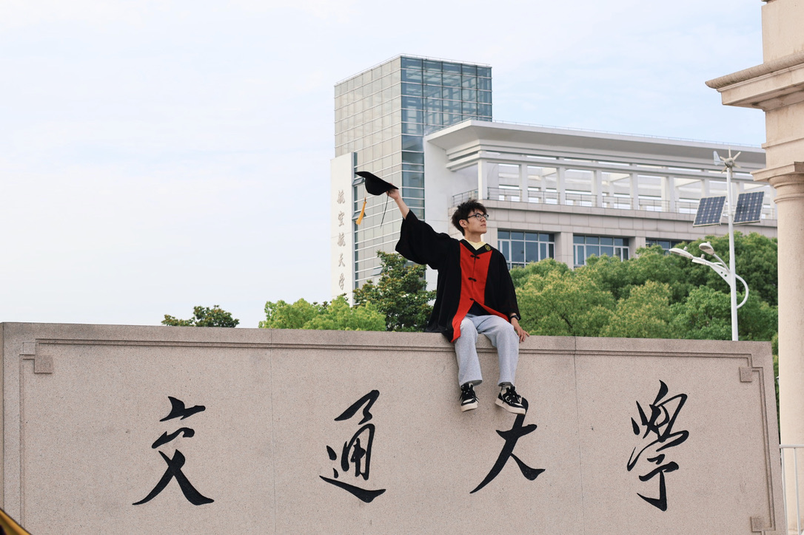

## 关于博客
你好！欢迎来到Electronic-Waste的小破站！

在2023年1月19日，它正式上线和大家见面啦！之后我会在小破站里更新自己的一些技术日常和思考，不定期总结和分享经历，欢迎来和我交流！

## 关于我
### 个人简介
我是Electronic-Waste，aka.王劭，上海交通大学软件工程专业20级本科生，计算机科学与技术专业24级学术硕士研究生。

生于非典，考于新冠。我出生于2002年，2020年从浙南一个美丽的海滨城市考入上海交通大学，误打误撞之下进入了现在的专业学习。
目前，我通过保研进入了[SAIL实验室](https://github.com/sjtu-sail)，主要从事云原生基础设施(Cloud Infrastructure)和网络(Network)方面的研究。

同时，我也是一名开源爱好者，在一些开源社区中担任职务：

1. Maintainer of [SJTU-SE](https://github.com/SJTU-SE)：上海交通大学软件学院的民间组织

2. Review of [kubeflow/katib](https://github.com/kubeflow/katib)：Kubernetes上的AutoML组件，kubeflow的子项目

在未来，我希望成为一名基础架构工程师，开发可扩展、鲁棒、高性能的云原生AI/存储系统！

### 为什么叫Electronic-Waste

计算机的基础是一个又一个的晶体管--->Electronic（电子的）

专业大佬很多，课程也很难，作业不会写，让我感觉自己是fw--->Waste（垃圾，废弃物）

天哪！这两个词合起来说的不就是我嘛🤡——一个正在计算机相关专业就读的fw！
