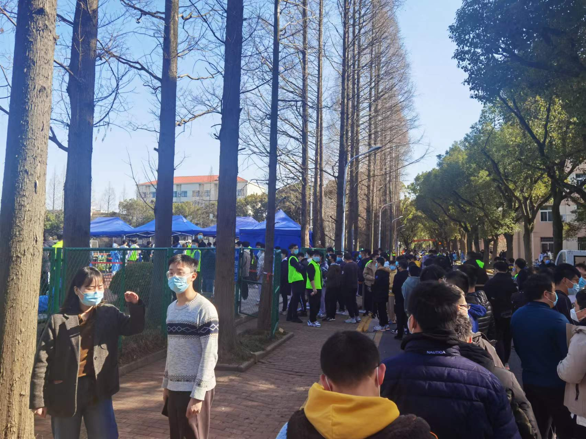
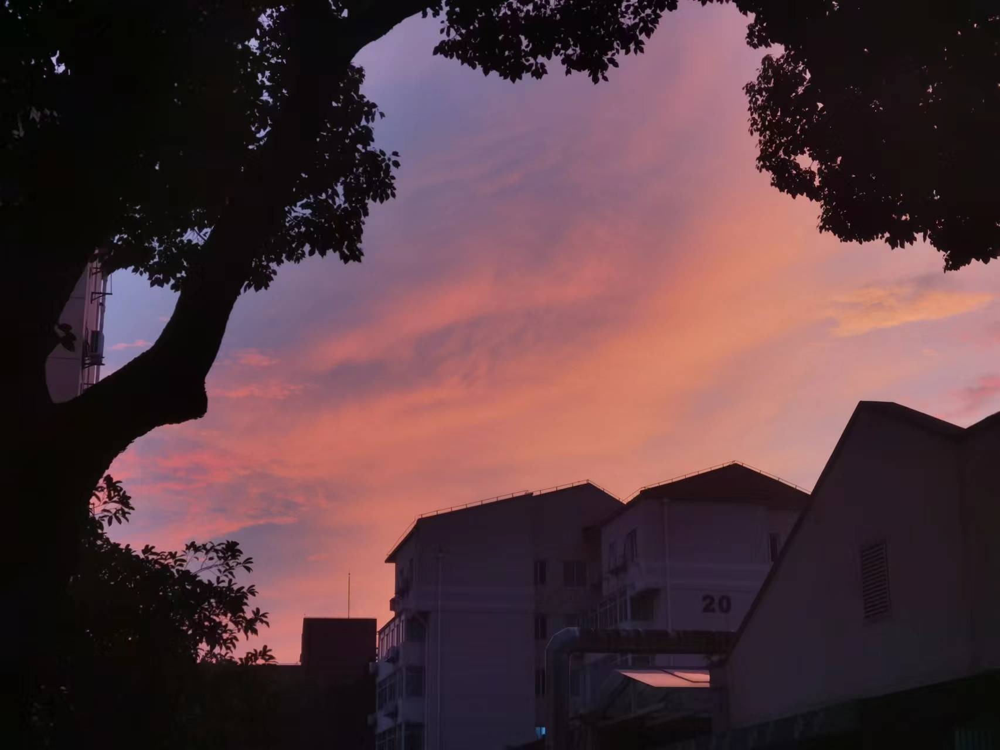
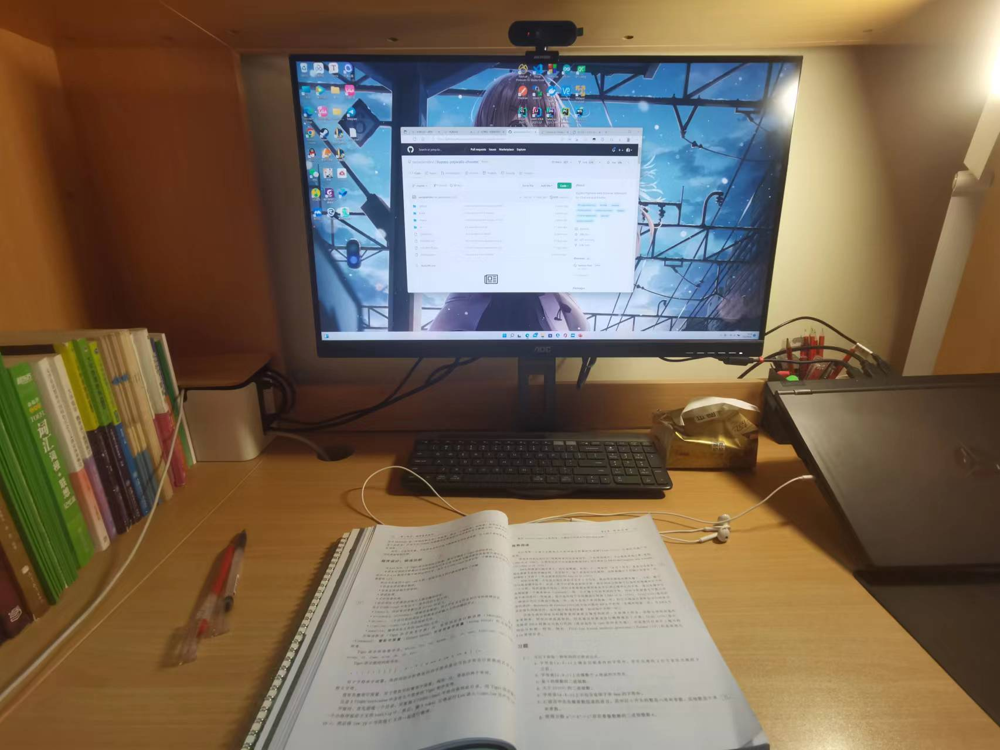

+++
author = "Electronic-Waste"
title = "2022年度总结"
date = "2023-01-21"
description = "2022，终于结束了！"
categories = [
    "Conclusion"
]
tags = [
   
]
+++

> 今晚是除夕夜，非常适合发这种总结性质的博客——辞旧迎新，2022不去，2023不来。
> 
> 从1月14日晚上答辩完正式放假之后，除开吃年夜饭、外出游玩和选购衣服所耗费的时间，我几乎将所有的时间精力投入到了搭建自己的博客中，不过在写完这篇博文之后就要告一段落了（也就是说我很久之后才会更新🐶）。
>
> 那么，我们开始吧！

## 前言
相信对每一个在交大或者在上海其它高校度过2022年的同学，都会觉得这是非常艰难的一年。

三月份起上海前所未有的大面积封控刷新了武汉疫情以来的所有记录，作为上海疫情爆发最早的地方之一，交大首当其冲。正常的教学秩序被打乱，生存环境仿佛一下子倒退回了计划经济时代，社会中出现的种种乱象也一次又一次刷新我的三观...这个世界天旋地转，也带着身处其中的我卷入其中——内心兵荒马乱，应对学业捉襟见肘，结束了一份破碎而又折磨的感情。

都说，现实比小说更加魔幻，等我经历过这么一遭之后，才真正明白"艺术来源于生活"的真正含义

> 苦难本身并不值得感谢，感谢的应该是勇敢面对苦难的自己

那些痛苦的经历，消极负面的想法就不在我的年终总结里面分享了。我希望多年之后回望2022，更多想起的不是当时的苦难，而是面对苦难时勇敢的自己。

与诸君共勉。
## 大二上的尾巴
在我的印象里，大二上应该是我上大学以来最轻松的一个学期。相比于电院其它专业，我们不用学习数电模电还有电子技术实验，也没有工科创之类的焊板子造火箭课程，所以相对过得比较舒适。每天我都能睡得很爽，每周五都能和亲爱的室友[Weijinglin](https://github.com/weijinglin)同学在一起上完动漫课之后去打篮球😆，技术不佳的我一般只能通过身体优势碰瓷哈哈。

在学习方面，由于在大二上有一波各专业的超级巨佬转入，我的学积分排名一下子从10%给干到了20%，当时还略微有些郁闷哈哈哈。不过后来想想对我也没太大影响，因为我也不是那种非得卷到前几不可的人，同时也没有这个实力。而且这样的排名对于“差不多就行了”性格的我来说，是比较舒适的，因为不用卷上天才能维持成绩，只需要平时认真学习好好做作业，期末熬夜肝一肝就行了（都是大学生了，不会有人期末不熬夜吧🐶）。

同时让我意想不到的是大二上结束之后我达到了之后几个学期学积分排名的巅峰，刚好在15%的位置，我的信心可以说是来到了大学的巅峰哈哈哈。

开开心心地回家过年！

## 在封控中度过的春季学期
之前就总听学长说大二下是最折磨的一个学期，但当自己真正看到课表和各门课的课程要求才真真切切地感受到自己要完蛋了🤡

各科课程：
1. **计算机系统基础(组成)**：院长上的课，主要讲流水线、代码优化、存储、虚拟内存之类的偏底层的东西。一共有5个Lab，都很难😭，workload巨大，还有期中期末两次考试

2. **计算机系统基础(系统软件)**：陈榕老师上的课，主要讲进程流控制、系统级I/O、网络以及一些并发相关的东西，一共有两个Lab，这门课workload还不算特别大（但是Network的那个Lab还是写得我想死😭）

3. **互联网应用开发技术**：陈昊鹏老师开的课，感觉真的是我上过学以来接触到的信息密度最大的课程了，质量真的非常高！一个学期教你速通前端、后端和数据库，大作业硬核无比，要求开发一个电子书店，一共分为四次答辩——第一次答辩html+css的前端，第二次要求用React改写并完善相关页面，第三次要求前后端数据库贯通，第四次要求实现全部功能。老师也很会写代码，对html、css、javascript、java还有sql的理解都非常深入，遇到讲不清的问题就直接切IDE开始写代码，讲得真的是深入浅出！只要用心学都能学得会！但是workload真的好大😭😭😭,几次通宵都是因为这门课要答辩，遇到一些奇奇怪怪的bug(或者说是React的feature🐶)还得到处找博客看。在这里还得再次感谢两位室友[Weijinglin](https://github.com/weijinglin)和[Waleve](https://github.com/waleve)的救命之恩，不然我的代码根本写不完。

4. **软件工程原理**：略微有点无语的课程，课上讲的是类图设计、软件开发过程之类的比较偏方法论的东西，但是感觉大二下上这门课还有点太早了，刚接触专业课的我们并不是很能理解这门课讲的内容的实际应用。而大作业也是和互联网课类似的，四人一组完成一个应用的开发。但不同的是这门课并不会教你如何写代码，也就是说得等互联网课上到相关内容之后才能开始写。也就是说互联网课的快乐翻倍了🐶，得同时多线开工，大G特G！

5. **高级数据结构**：workload同样巨大的课程。每周都要根据上课内容实现一个具体的数据结构，并且对它们的性能进行测试对比，然后再交一篇实验报告。除此之外，还有ipads精心设计的4个lab和1个project，绝对酸爽！尤其是这个project，让我们写了一个LSM-Tree，bug真的是巨难de，实现也巨复杂，最后的实验报告还要用LaTex写，属实难顶。这门课真的是一节比六节强(16+4+1的作业量问你服不服)

6. **计算机中的数学基础**：由三个老师分开来上，个人感觉讲得最好的是李国强老师，虽然我都听不懂哈哈，但是感觉听起来感觉很有条理，思路很清晰（是我愧对老师的教诲！😭)。第一部分是自动机，第二部分是凸优化，第三部分是数值计算。大作业基本都取消了，相关内容放到了期末考试，不过最后还是留了一个使用Python完成矩阵计算图像处理的lab，在我们寝室的小组分工之下较为顺利地完成了😋。但这门课真的挺难的，最后分数也挺烂的...

7. **大学物理(A类)(3)**：传说中的量子力学，由传说中带着口音的fsm老师上。很好奇是哪个领导拍脑门弄出来的课，工科居然还要学一个学期的量子力学。上课基本听不懂，考前全靠当了14年小镇做题家的应试能力才活过期末（最后考了99哈哈）...

8. **毛概**：不想多说，懂的都懂。

事实上不出所料，果然完蛋了！

但是出人意料的是，先完蛋的不是我，是交大😭

3月9号那天醒来，看到群里老师发通知让去上早八的同学回宿舍，之后进行线上上课。当时还挺兴奋的哈，上蹿下跳，早八能躺床上上了干嘛不开心呢🐶？但是我是真的没想到疫情持续的时间会这么久。等下一次走出学校，就已经是7月份了；等下一次再线下，就已经是11月份了...

 

 

之后完蛋的是我🤡

由于疫情原因，本就压力山大的大二下变得越来越糟糕。更要命的是我还作死报了托福，每周上一天的课。对！是整整一天（后来由于时间问题翘掉了好多）！慢慢的，考试开始来不及复习，从来准时交作业的我开始有大量的作业逾期。心情一天天变得十分糟糕，不再有动力去憧憬未来，也再不愿意去相信未来会有美好的生活。在早上很早被喊起来做核酸的时候经常有一种想死的冲动，面对困难的专业课产生了畏难的情绪而逃避，很多时候只是呆呆地坐着什么也不想干，思考着人生的终极奥义是什么...多的就不说了，总之就是非常的折磨，不论是恶劣的外部环境，还是自己的精神内耗。

或许也是这一段经历让我明白，以前自己一直追求的成绩、成功还有荣誉都是不值得一提的东西，没有什么比健康快乐更加的重要，三观也开始慢慢地发生变化。同时，我也看到了疫情之下普罗大众所经历的苦难，开始去思考一些社会现象背后的本质原因，开始对以往深信不疑的东西还有一些所谓政治正确的东西开始抱有怀疑的态度。可以说，成长了很多吧，希望再以后回忆起来的时候，能感受到自己这段时间的蜕变。

> 世界上只有一种真正的英雄主义，那就是在认清了生活的真相之后依旧选择热爱生活

之后照例是考试周，线上线下考不知道是哪个鬼才想出来的，为什么在教室里考试也要用电脑在线上答题啊？？？
## 暑假
### 小学期课程
在期末周结束之后我们就马上转入小学期上课了😭

什么？你问我那不是还有一个周末可以休息嘛？

哈哈，我们有两次答辩分别在周六周日，几乎都快通宵了，哪来的时间休息🤡。一次是互联网电子书店的答辩，虽然没做完但还是蒙混过关了；另一次是软件工程原理与[Weijinglin](https://github.com/weijinglin)、[Waleve](https://github.com/waleve)还有[Song-jq](https://github.com/song-jq)合作的Semo项目答辩，给老师骂的狗血喷头，“这有什么工作量”“欸，你这个怎么点不开”...

然后下一个星期一就开始上小学期的课了——《互联网产品设计与开发》，四学分，一共上四周，暑假回来答辩。我们小组的选题是实现一个在线虚拟形象聊天室，成员还是和上个学期Semo的阵容一样@[Weijinglin](https://github.com/weijinglin)@[Waleve](https://github.com/waleve)@[Song-jq](https://github.com/song-jq)@[Electronic-Waste](https://github.com/Electronic-Waste)。

这一整个暑假我们都在写这个项目，中间遇到了重重难关。感觉最难的还是技术选型和需求定义这方面，其它的倒全部都是工程量的问题。在一系列的讨论之下，我们放弃了前端Unity+WebGL的实现思路，转移到了我们熟悉的React路线上，调用了一些现成的库实现前端虚拟形象的构建。还有关于我们要把软件做成什么样的问题，我们更是争辩了好久才确定下来（幸好没急着开始写代码，要不然就要大面积返工了）。

此外通过暑假的项目学习，我们开始接触到了云服务器以及相关的配置（为我博客的建立打下了基础哈哈😆）。我们买了两台ECS，配置VPC把它们弄到一个网络里面，用NAT配置了出/入口流量规则，配置了SSL证书实现HTTPS协议通信，搭建了Nginx实现请求代理转发。虽然过程是痛苦的，但我也学到了很多有用的东西，和大家的合作也非常愉快！该正经的时候正经，该嬉笑打闹的时候绝不端着。

### 情感波折
在暑假结束了一段早就该结束的痛苦而又折磨的感情，浑身都开始轻松起来了哈哈!

第二天就和hxd@洲洲(bhys他没有Github账号😭)去温州市区玩了，K歌什么的哈哈，好开心！

然后八月初我就回学校了，把学校里所有能承载之前那段记忆的东西全处理掉了，这几乎把我位置的东西全清空了。我拎着几袋处理掉的东西，毫不留恋地走向垃圾站，感觉自己仿佛迎来了新生。

### 回到学校后的生活
在学校里迎来了自己的二十岁生日，那天没有发朋友圈也没有发QQ空间，而是静静地享受独处时光

记得那天的晚霞很美很美，直逼35℃的气温也没能阻止我出去打球

 

### 托福
因为之前报了托福，虽然后面已经放弃了出国的想法，但毕竟是2K+大洋🤡,实在无法做到直接不去考，于是就去苏州大学裸考了

 

考前一晚上做了一套真题，第二天就匆匆上考场了，结果当然是很烂的😭

烂到有点对不起我浙江高考英语140，四级645，六级605的成绩，就不放出来让大家看笑话了😭

不管怎么说还是给之前自己出国的想法画上了一个句号，可能不是太圆满哈哈。之后可能再去补救一下，争取把这个句号画圆满。

> 关于出国的问题：
>
> 我无意评判保研/出国两条路的优劣，在我看来这两条路都很好。只是因为自己的人生目标发生了变化，感觉到保研更适合自己罢了。而且我感觉自己也不属于极度优秀的那种同学，也没有志向要在学术上有很高的造诣，因此出国对我来说不是一个必选项而是一个备选项。总的来说，自己还是比较希望安稳一些，留在国内开开心心的就好。

## 军训&军训之后
说实话一开始挺讨厌军训的，也非常不喜欢这种形式主义的东西。但是交大的军训超级水，与其说是军训不如说是和大家在一起玩了14天，最后也挺开心的哈哈。最开心的是那个细雨蒙蒙拉练的夜晚，我们绕着学校走了一圈，一路走一路唱，感觉超级棒！

一些小插曲是，我作为我们连队和女生连队联谊的代表，要和另外两个xd一起跳王心凌的《爱你》，场面一度十分尴尬哈哈哈。军训之后成为了大家口中的“爱你哥”，狠狠地刷了一波存在感😋

视频就不放出来了，要脸哈哈哈

军训结束之后便是我们《互联网产品设计与开发》这门课的答辩，答辩前5min我发现我写的部分出了一个bug可能导致整个页面崩溃，于是疯狂改代码，重新部署，在这期间让其它三个xd在腾讯会议室里面拖着老师直到我改完了Bug。真的又是一波极限操作🤡

最后答辩的时候，虽然我们的代码有很多Bug，但是演示过程中竟然一点状况都没出，顺利完好地运行了下来！这真的是一个奇迹！

最后也取得了非常满意的分数哈哈，和各位@[Weijinglin](https://github.com/weijinglin)@[Waleve](https://github.com/waleve)@[Song-jq](https://github.com/song-jq)的合作非常愉快！
## 梅开二度的秋季学期
谁能想到开学第一天交大就又GG了呢？🤡

又一次线上上课，我们已经十分的熟练了，幸运的是我们楼栋并没有出现阳性病例，但不幸的是我的摆烂生活又开始了哈哈。

这个学期的前半段没怎么学习，一个劲地放飞自我哈哈。为什么呢？因为可能感觉自己失去了努力奋斗的目标吧，如果只是为了读一个研究生，那么已经完全可以躺平了，基本已经不需要努力了。总而言之，就是处于一种混子的心态吧。

不过课余生活是真的挺丰富的哈哈，反正就是除了学习什么都干🐶

 

 

> 关于学习动力的后续
>
> 找@洲洲聊了聊，开始认识到摆烂的危害性。如果以后要发展更多的爱好，必须要有更好的经济条件作为支撑，这需要持之不懈的努力；为了更好的生活质量，也需要努力。我开始慢慢地上道了，不过有点迟了，快学期结束了，已经开始出现ddl大面积逾期了😭。

这个学期有三门比较硬核的课程：
1. **编译原理**：前半部分由院长上，后半部分由吴明瑜老师上。主要讲的是现代编译器如何将代码转化为可执行的机器语言，以及其它的高级性质，包括词法分析、语义分析、类型检查、逃逸变量检测、代码翻译、机器语言生成还有寄存器分配，以及包括垃圾回收、函数式编程还有面向对象语言在内的高级性质。一共有8个Lab(lab5拆分成了两个)，前面3个Lab难度还好，后面5个Lab难度开始指数级上升，每个都要花费很多的时间精力😭，极其的硬核。但是感觉做完之后对能力尤其是debug的能力有很大的提升，此外还能学习到一些c++17之后的新特性以及STL库的使用，收获真的很多。感谢设计这个Lab的助教和老师，你们用心良苦，但无奈我实在太菜了😭，Lab延期了4个，作为bonus的Lab7我直接没写，实在是愧对你们。

2. **计算机系统工程**：由夏虞斌老师和魏星达老师合上。主要讲文件系统、分布式事务处理、网络以及安全相关的内容，讲得比较杂，感觉属于通识类的东西，让你对计算机系统和分布式、网络、安全的知识有一定深入的了解。这门课的5个Lab也比较硬核（其中Lab2拆分为AB两个），实现了chfs文件系统、Atomicity、RPC&Lock server、Raft分布式系统以及基于Raft的MapReduce工具。可以说也十分的硬核，但做完之后会对其中的原理有更为深刻的认识。不出所料的，我又有好几个Lab延期了😭，现在真的想回去一巴掌拍死前半个多学期在摆烂的自己。夏老师和魏老师讲课讲的都很好，尤其是夏老师感觉很有人格魅力，很有幸能上到这样的课哈哈哈！

3. **应用系统体系架构**：依旧是陈昊鹏老师开的课，依旧是十分的硬核。不过与上个学期的互联网课不同的是，这个学期的课讲的是小专题（意思是即使你上节课没听下节课也能听得懂）。内容很广，包括事务机制、消息机制、websocket、多线程编程、安全机制、Redis缓存、全文搜索、微服务架构、范式、数据库优化、Nosql数据库以及集群，共有12次作业，每次作业相当于在大二下实现的bookstore上进行一些小的优化。这门课从学期初到学期末，感觉就是在配置一堆奇奇怪怪的环境，而且配环境的时间远远长于真正写代码写文档的时间😭。真的是究极折磨！！！每次配环境都会给我整出一堆莫名其妙的问题，然后我就会疯狂从网上找博客，疯狂问老师问同学，和环境问题大战三百回合，一天从早上肝到晚上，有时候真的都快崩溃了。到了最后，就像选课社区的同学说的那样，由于一个学期配置的环境太多，以至于最后开bookstore就像开核弹一样哈哈哈。但yysy，这门课质量还是很高的，不仅可以学到一些优化互联网应用性能的策略和机制，还可以在配环境的过程中极大地磨练自己的心性和搜集资料（骚扰老师同学）的能力哈哈哈！也是强烈安利！😋

总而言之，在这三门课的压迫之下（其中有一门是系统软件方向的选修课），我甚至感觉这学期过得比大二下还累😭。当然也有可能是因为我前面太摆烂了，导致作业全都压到了最后面。这些课真的让我开始怀疑自己到底适不适合学计算机了，我的自信心受到了疯狂的打击，一度想研究生换个专业读读(bushi)。

此外，在疫情中，做了一年的PRP终于结束了。九月底在@[WindowsXp学长](https://blog.windowsxp.dev/)远程的指导下调试完成了他开发的接收串口信号的安卓程序，并和我负责的NFC信号检测模块整合到了一起，顺带着水了5K字的论文。一路走来感觉挺不容易的，刚加入PRP项目组的时候是大一下结束的时候，当时还什么都不会，基本什么事情都是学长干的，我就负责UI设计、机械加工还有视频制作，开小组会议讨论的时候我基本啥都听不懂😭；后面接触了专业课之后开始能去写一些前后端程序，才能协助完成一些开发工作。其实一开始想出国有一部分原因也是受学长影响，一心想润的学长让我也对海的另一头产生了某种憧憬，不过后来还是发现自己可能没有这个实力。同时也挺感谢学长Github账号里各种各样的repo🐶，没有它们我可能真的活不下去，大家也可以去挖掘一下，说不定有意外收获哈哈。此外，我没有白嫖！

 
## 好不容易向好的秋季学期
到十月底，我们开始恢复线下教学的秩序。到了上课的第一天，真的有一种莫名的感动，等这一天快等了八个月，而大学能有几个八个月？只希望以后不要再有线上课了，和老师同学线下面对面交流的感觉，不是冷冰冰的屏幕所能代替的。

这段时间没发生什么大事，出校审批越来越松，我每天出校都用同样的理由。每天早上七点多起来去校外的健身房，然后回来赶每天十点的早课，日子别提多舒适了。不过这段时间感觉依旧有些摆烂，对作业仍不理不睬（作业：“你礼貌吗？”），事实证明作业也很快给我迎头痛击🤡

不过这段时间，社会上倒是发生了很多事情，乌鲁木齐火灾、学长去世、二十条&新十条出台。我的感触也颇深。

 
 

只有一声叹息......
## 始料未及的梅开三度
实在没想到一年里居然还能梅开三度，居然还能有幸见证重大的历史关头🤡这属实让我猝不及防

由于学校的疫情逐渐失控，12月10号我就回到了家，蹦跶了几天哈哈哈（有人还没意识到作业的紧迫性）

 

等我意识到事情的紧迫性时，离期末差不多就只有两周了🤡

大家可以感受一下期末周前我到底有多少作业没写哈哈，反正就是紧赶慢赶才在考试前一天写完

最后重考了一门机器学习，实在顶不住了。考完算法之后又在使劲赶逾期的编译Lab，直到答辩的前一夜才过完所有的测试点。答辩完那一刻我感觉整个人都轻松了——假期终于开始了，要过年了！爷 is free!!!我要打好多游戏，我要每天睡到中午起床，我要去挑我喜欢的新衣服！真的好激动！

但不过，可以预见到的是，这学期的学积分排名会稀烂😭😭😭不过我倒是没有很难受，总有好的时候也有不好的时候，而且我感觉这样子对我来说也是一个警醒吧，让我看看摆烂的后果是什么😭

最后，在期末周压力最大的时候，我从一个很好的人那里获得了精神动力。希望我以后也能一直开心，面对苦难险阻一直保持昂扬的精神状态！我想在这里谢谢你！
## 展望
窗外的爆竹声不绝于耳，它预示着新的一年即将到来。与此同时我的年终总结也快写完了，回望我的2022，有很多痛苦和磨难，也有很多开心和快乐，但更有那个勇敢的自己！新年的钟声即将敲响，我在这里先给大家拜个早年了，大家新年快乐呀！

展望2023，我希望天下不再有因疫情而起的苦难，希望自己不被困难打倒一直昂扬前进，希望人世少一些纷争多一些理解，希望诸君每天都能有一个好心情！

同时，我也想给自己提一些具体的要求：

1. 下学期别摆烂了，好好学习！

2. 尽快明确自己的方向，及早规划自己的未来，对自己负责！

3. 真诚对待每一个向我寻求合理帮助的人，尽力所能及之事

4. 积极地去探索新的东西，走出舒适区，始终对生活保持热情

> 爆竹声中一岁除，春风送暖入屠苏。

新年要有新气象。各位，我们新年再见！
