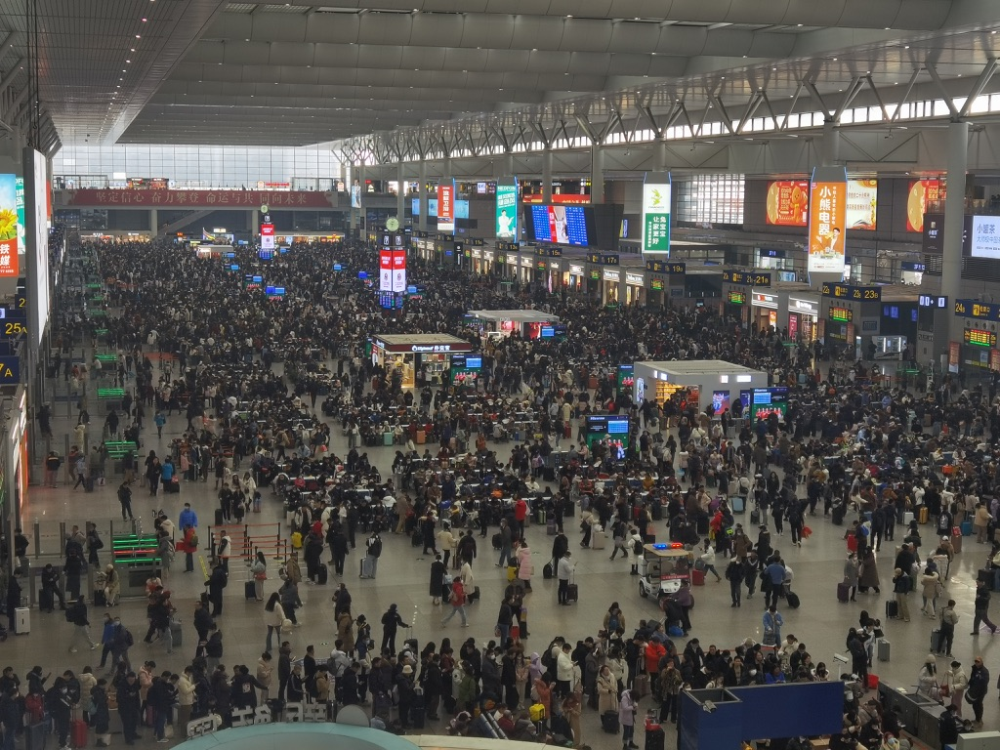

+++
author = "Electronic-Waste"
title = "2024年度总结"
date = "2024-12-07"
description = "我想，我会无比怀念这一年"
categories = [
    "Conclusion"
]
tags = [
   
]
+++

## 前言

2024年1月8号，天很冷。但是刚打印好的毕设初稿拿在手里还是热乎乎的，我激动地把它递给任老师，“老师这是我的毕设初稿，都弄完了“，回应我的是意料之中的赞许。离研究生开学还有八个月，面对即将到来的、可以算得上是人生中最自由的一段时光，我既忐忑，又满怀憧憬。

一转眼又到了年底，初冬的上海还是那么的冷入骨髓，和年初交毕设初稿时不相上下。回望过去的一年，我感慨道，“真快啊，大学毕业了，成为牛马研究生了”，回应我的却是一个又一个意料之外的惊喜：**一段神奇的缘分、四段实习经历、向我敞开怀抱的开源社区，还有那让我毕生难忘的毕业旅行**······我从未感到如此自由、如此青春，仿佛世间所有的美好都在向我展开。我想，我会无比怀念这一年。

## 大年三十的上海虹桥站

印象中好像从来没有这么迟回家过年，今年是头一遭。

事情要从交完毕设说起，在任老师的推荐下，我进入了一家和我们实验室有合作关系的量化公司实习。由于成为半个牛马了，自然也要遵循牛马的作息，在学校生活惯了的我此刻也才真真正正对什么是“法定节假日”有了一个切身的体会：过年只有九天假期——虽然早已料到，但是却实在难以接受。相比于学校动辄四周的寒假，打工人的假期真的是太少太珍贵了。

在虹桥站，我看着攒动的人头，不禁觉得决定继续读研是一个正确的选择。毕竟人生那么长，留给工作的时间还有四十年，花个两三年的时间读个研给自己的学生时代续费，也算是一个不错的人生体验。

在我的[另外一篇博客](http://blog.electronicwaste.cn/p/四月告别邦戴/)里，我详细描述了这段实习经历，在年终总结里我就不做展开了（笑）。

在实习之前，在网上各种信息&SE大环境氛围的影响下，我对量化抱有极高的热情和期待，觉得量化是当代CS/SE学子的版本答案，以后就业也是非量化不去。但是实习之后，我开始对量化有了一个更为理性的看法，用一个流行的词语来形容，就是对量化“祛魅”了。

在我看来，量化（开发）的好处有：

1. **💰多**：我相信这个量化是吸引大部分人的原因
2. **WLB**：早九晚六不加班，对身体友好

坏处有：

1. **非头部量化技术陈旧**：基本上都是十几年前的东西，在非核心岗待久了会慢慢变得没有竞争力（非核心岗是相对于**高频交易系统开发等核心岗**而言的，不可能每个人进去都搞交易系统，极大概率分去搞Infra、测试、偏运维的岗位）。
2. **HC少，和互联网技术栈不通用**：体现在行业圈子小，跳槽对象少，也基本不可能往互联网跳。
3. **行情不稳定**：国家不鼓励量化发展，行业过几年是否存在都是个问题...
4. **氛围问题**：众所周知量化的核心是交易系统和策略，因此在透明度和防贼等方面可能会用力过猛。

综合以上和个人兴趣因素的考量，我放弃了进非头部量化的就业意向。如果想去量化的话，我鼓励大家早点实习一次看看，毕竟只有自己试过一遍才知道究竟量化适不适合自己，然后慢慢做排除法，逐渐摸索出自己要走的路。

## 清明前夕的北京

在2024年4月3日，清明节前夕，我和吴双在北京缔结了契约，成为了男女朋友。

这段缘分来的十分奇妙又突然，在初春，在本科快毕业的时候，在那段自由的、发着光的日子里，这或许是上天最好的安排。一路上，我们积攒了很多甜蜜快乐的瞬间，一起去了很多很多地方、互相见证对方的重要时刻，我们也因此变成了京沪高铁的常客；也有一些不那么甜蜜、想要放弃的时刻，不过好在我们还是我们，因为爱意最终选择坚持，像她最喜欢的歌手JJ唱的那样，“这一生原本一个人，你坚持厮守成我们，所有未来说好一起等...”。

吴双问过我，我喜欢她什么。我想，在褪去了最初的新鲜感，摘掉了情侣间的柔光滤镜之后，我最喜欢的是你身上的松弛和自洽。我是一个紧绷的人，时时刻刻在思考之后要做什么，之前一段时间里做的怎么样，怎么样才能最大化现有时间的价值，让我自己都时常觉得窒息。有的时候我想成为你，看淡外界的一切东西，专注于自己的感受和生活，懂得取悦自己，松弛而自由地活着，而不是成为一台整日忙忙碌碌的机器。

## 在交大拍毕业照

## 拥抱开源

## 毕业旅行

## 敬那些难以忘怀的时刻！

## 2024再见，2025你好👋