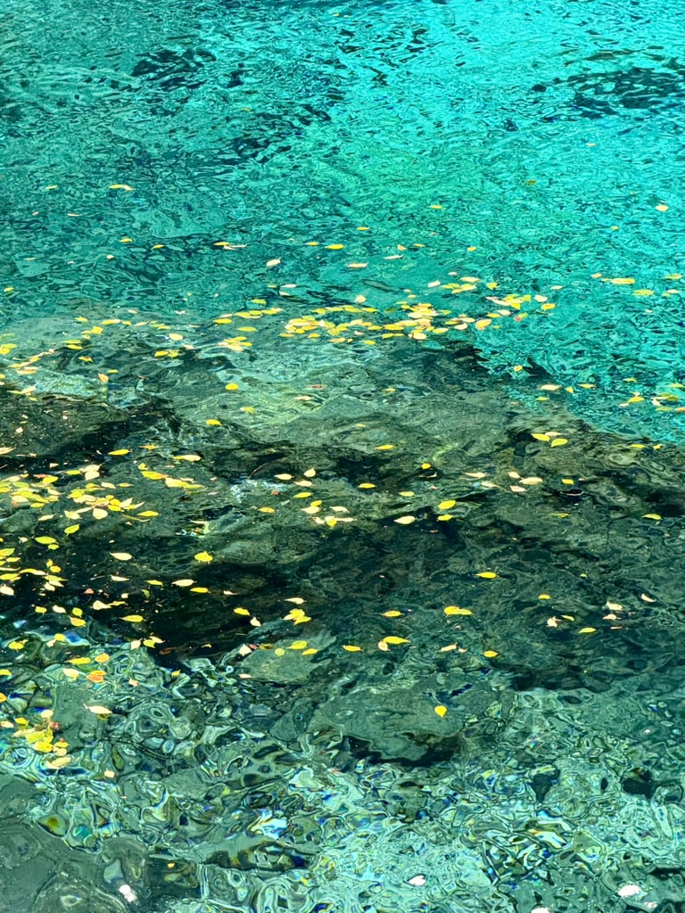

+++
author = "Electronic-Waste"
title = "2024年度总结"
date = "2024-12-31"
description = "我想，我会无比怀念这一年"
categories = [
    "Conclusion"
]
tags = [
   
]
+++

## 前言

2024年1月8号，天很冷。但是刚打印好的毕设初稿拿在手里还是热乎乎的，我激动地把它递给任老师，“老师这是我的毕设初稿，都弄完了“，回应我的是意料之中的赞许。离研究生开学还有八个月，面对即将到来的、可以算得上是人生中最自由的一段时光，我既忐忑，又满怀憧憬。

一转眼又到了年底，初冬的上海还是那么的冷入骨髓，和年初交毕设初稿时不相上下。回望过去的一年，我感慨道，“真快啊，大学毕业了，成为牛马研究生了”，回应我的却是一个又一个意料之外的惊喜：**一段神奇的缘分、四段实习经历、向我敞开怀抱的开源社区，还有那让我毕生难忘的毕业旅行**······我从未感到如此自由、如此青春，仿佛世间所有的美好都在向我展开。我想，我会无比怀念这一年。

## 大年三十的上海虹桥站

印象中好像从来没有这么迟回家过年，今年是头一遭。

事情要从交完毕设说起，在任老师的推荐下，我进入了一家和我们实验室有合作关系的量化公司实习。由于成为半个牛马了，自然也要遵循牛马的作息，在学校生活惯了的我此刻也才真真正正对什么是“法定节假日”有了一个切身的体会：过年只有九天假期。虽然早已料到，但是却实在难以接受。相比于学校动辄四周的寒假，打工人的假期真的是太少太珍贵了。

在虹桥站，我看着攒动的人头，不禁觉得决定继续读研是一个正确的选择。毕竟人生那么长，留给工作的时间还有四十年，花个两三年的时间读个研给自己的学生时代续费，也算是一个不错的人生体验。

在我的[另外一篇博客](http://blog.electronicwaste.cn/p/四月告别邦戴/)里，我详细描述了这段实习经历，在年终总结里我就不做展开了（笑）。

在实习之前，在网上各种信息&SE大环境氛围的影响下，我对量化抱有极高的热情和期待，觉得量化是当代CS/SE学子的版本答案，以后就业也是非量化不去。但是实习之后，我开始对量化有了一个更为理性的看法，用一个流行的词语来形容，就是对量化“祛魅”了。

在我看来，量化（开发）的好处有：

1. **💰多**：我相信这个是量化吸引大部分人的原因
2. **WLB**：早九晚六不加班，对身体友好

坏处有：

1. **非头部量化技术陈旧**：基本上都是十几年前的东西，在非核心岗待久了会慢慢变得没有竞争力（非核心岗是相对于**高频交易系统开发等核心岗**而言的，不可能每个人进去都搞交易系统，极大概率分去搞Infra、测试、偏运维的岗位）。
2. **HC少，和互联网技术栈不通用**：体现在行业圈子小，跳槽对象少，也基本不可能往互联网跳。
3. **行情不稳定**：国家不鼓励量化发展，行业过几年是否存在都是个问题...
4. **氛围问题**：众所周知量化的核心是交易系统和策略，因此在透明度和防贼等方面可能会用力过猛。

综合以上和个人兴趣等因素，我放弃了进非头部量化的就业意向。如果想去量化的话，我鼓励大家早点实习一次看看，毕竟只有自己试过一遍才知道究竟量化适不适合自己，然后慢慢做排除法，逐渐摸索出自己要走的路。

## 清明前夕的北京

在2024年4月3日，清明节前夕，我和吴双在北京缔结了契约，成为了男女朋友。

这段缘分来的十分奇妙又突然，在初春，在本科快毕业的时候，在那段自由的、发着光的日子里，这或许是上天最好的安排。一路上，我们积攒了很多甜蜜快乐的瞬间，一起去了很多很多地方、互相见证对方的重要时刻，我们也因此变成了京沪高铁的常客；也有一些不那么甜蜜、想要放弃的时刻，不过好在我们还是我们，因为爱意最终选择坚持，像她最喜欢的歌手JJ唱的那样，“这一生原本一个人，你坚持厮守成我们，所有未来说好一起等...”。

吴双问过我，我喜欢她什么。我想，在褪去了最初的新鲜感，摘掉了情侣间的柔光滤镜之后，我最喜欢的是你身上的松弛和自洽。我是一个紧绷的人，时时刻刻在思考之后要做什么，之前一段时间里做的怎么样，怎么样才能最大化现有时间的价值，让我自己都时常觉得窒息。有的时候我想成为你，看淡外界的一切东西，专注于自己的感受和生活，懂得取悦自己，松弛而自由地活着，而不是成为一台整日忙忙碌碌的机器。

## 在交大拍毕业照

今年我本科毕业啦！四年过的真快，快到我来不及细细品味青春，来不及走遍学校的每个角落，来不及向每个给我留下印记的地方道别。住了四年的小破X16宿舍、陪我见证了无数个期末周夜晚的中院小教室、学服被磨秃噜皮的哑铃、emo时必去的思源湖和必吃的麦麦炸鸡，都是青春里像珍珠般发着光的碎片。我会把它们收进记忆的锦盒，永远珍藏、怀念。

 

  

青春已然按下加速键，步入了后半场，不过值得欣慰的是大多数朋友都选择了留在本校读研，所以也不会让我产生一种物是人非的感觉。只不过宿舍从西一区搬到了东四区，相见的地点从上中下东上东中东下变成了软件学院大楼，同样的人，不同的配方，其实也挺好。

Ops还是我的室友，从一个宿舍的对角线变成了上下铺，在大一大二卷生卷死，在大三大四惨遭毒打之后心态变得平和多了。虽然偶有加班，但是也经常能看到他躺在床上打手游了，甚至会和我们一起快乐打瓦了，这在以前是很难想象的事情（笑）。

奕文去了计算机系，做上了他大一想转专业的时候就梦寐以求的CV/CG，和电话线另外一端的“喂，xl”最终在你交团聚了，现在一起吃饭的时候终于不用谈二手恋爱了（捂脸）。不知道现在他还会不会上课前五分钟极限起床，踩铃声进教室，我猜应该没太大变化。

青青这四年里一直很佛系，在保研前夕拼命努力一把梭哈，成功进入了一个成果不错、氛围宽松的实验室做MLSys，我们时常调侃他才是我们四个中的“人生赢家”，过上了我和Ops梦寐以求的生活。现在他还是一如既往地过着佛系的生活，时不时找我们出来玩。

 

## 拥抱开源

我觉得，我今年在学业上做过最正确的事情，就是加入开源社区。

在年初，经历过许多次简历投递和面试失败之后，我开始思考一份好的简历是什么样子的。想来想去，面试官所看中的无非也就是三点：

1. **实习**：如果能兼顾方向相关、大厂titile、Solid Work的话，为上佳，如果不能同时兼具的话有两个其实也很不错，对找实习找工作有极大帮助。
2. **项目**：有影响力的项目（Github高Star项/者业内知名的开源项目），**学校里的课程大作业/毕设等toy project几乎不能算**，随便问两句就要开始拷打八股了。
3. **论文**：以CCF-A会为佳，Sys/Network的话B会也行，但是要求方向强相关，否则不太关心。

如果没有这些亮点的话，面试官其实就只能去拷打你的Leetcode和八股了（或者借用toy project的背景拷打），拷打结束之后也只能给你打一个“基础不错”的标签，没有差异化的竞争优势，很难脱颖而出。

结合自身实际条件考虑，以及参考了实验室学长的成长路径之后，我决定**放弃论文这个选项，主攻实习和项目**。因此，年初在一些小的开源社区做了一些贡献练手之后，我开始进入Kubeflow社区，边实习边申请社区在谷歌开源之夏（Google Summer of Code，简称GSoC）的项目，最终也是成功申请上了一个优化超参数调整器控制平面的项目。依稀记得出申请结果那天，早上七点查到录取结果之后我就再也睡不着了，激动地抱着手机打滚，发了小红书又发了领英。即使现在来看，我依然觉得当时那么激动非常正常，因为GSoC是有Google在背书，相当于半个大厂实习（人生第一次啊）。

于是在暑期，我一遍兢兢业业地当着小学期助教，一边猛猛写这个项目，同时还特别喜欢“管闲事”，把一些项目无关的东西也揽过来做，经常跑去给别人的代码做review。不过幸运的是，我因此成为了最快完成项目的学生，也得到了Mentor极高的评价，并**在项目结束后一个月成为了Kubeflow的维护者之一**，至今仍然活跃在社区之中。

 

**我始终觉得，开源带给我的，远比我给开源的要多**。我在开源社区里面学到了很多东西，不仅仅局限于业内最先进的云原生AI技术，还包括开源协作、跨时区异步沟通、英语听（包括咖喱味的）和说；我成为了以前想都不敢想的一万多star的开源项目维护者，帮助新来的成员为项目做贡献，为实际的用户解答疑惑；我还因此收获了之后两段实习的offer，它们都或多或少与开源有关，让我一年之内积攒了四段实习经历（虽然有一段有点水没忘简历上放），这是我在年初做梦都想不到的。

因此，抛开成就感之类比较虚的东西，单纯从功利的角度来看，我也是强烈推荐大家进入开源社区做贡献，申请相关的项目的。因为做一个项目，就能同时收获实习和项目两个维度的提升，如果做的好的话还可能获得社区维护者这一title，效率极高，对找实习找工作帮助极大。

至于我，我会成为一个终身的开源社区爱好者。

 

## 毕业旅行

量化的实习在四月结束，由于早已完成毕设，接踵而至的不是毕业的焦虑，而是久违的闲暇。我去了许多很远的地方，拓宽了旅游地图，也是第一次有那么长一段时间从学业和工作中解脱出来，享受没有陡峭learning curve的人生。这是一段闪闪发光的日子，青春而又美好。

    

    

   

## 2024再见，2025你好👋

在大四的TODO List上画上一个又一个勾，去年末我对自己的期望，在新的一年里都一一实现：实习、开源、旅行······在短短一年里，我用多段实习认清了自己，学会了取舍与放弃；申请上了之前梦寐以求的开源项目，在Cloud Native AI System的道路上做了一些探索；用脚步丈量祖国大地，在深山、海岸、草原留下了属于自己的足迹。

面对即将到来的新的一年，我想我不会再迷茫，也有足够的底气去面对可能发生的一切事情，因此我不想祝自己好运，惟愿自己永远保持谦卑保持好奇，继续在自己选定的道路上摸索、摔倒、挣扎、前行。

2024，再见；2025，你好👋