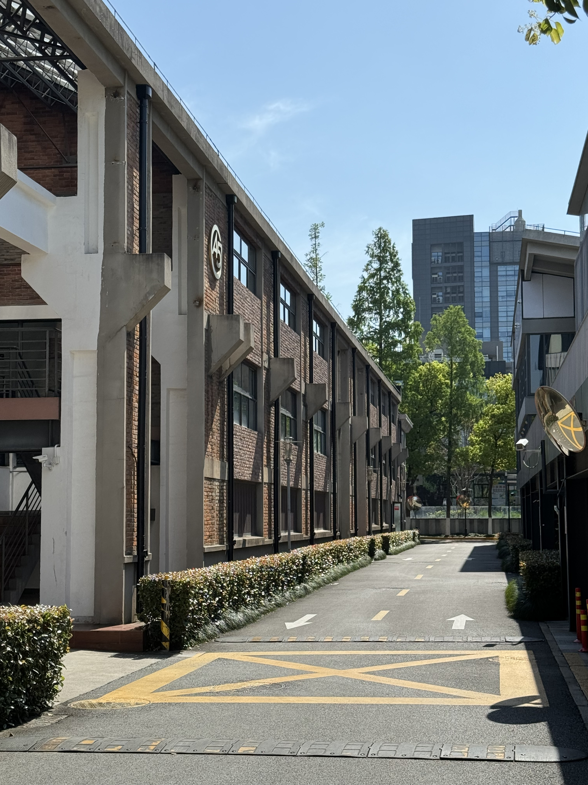
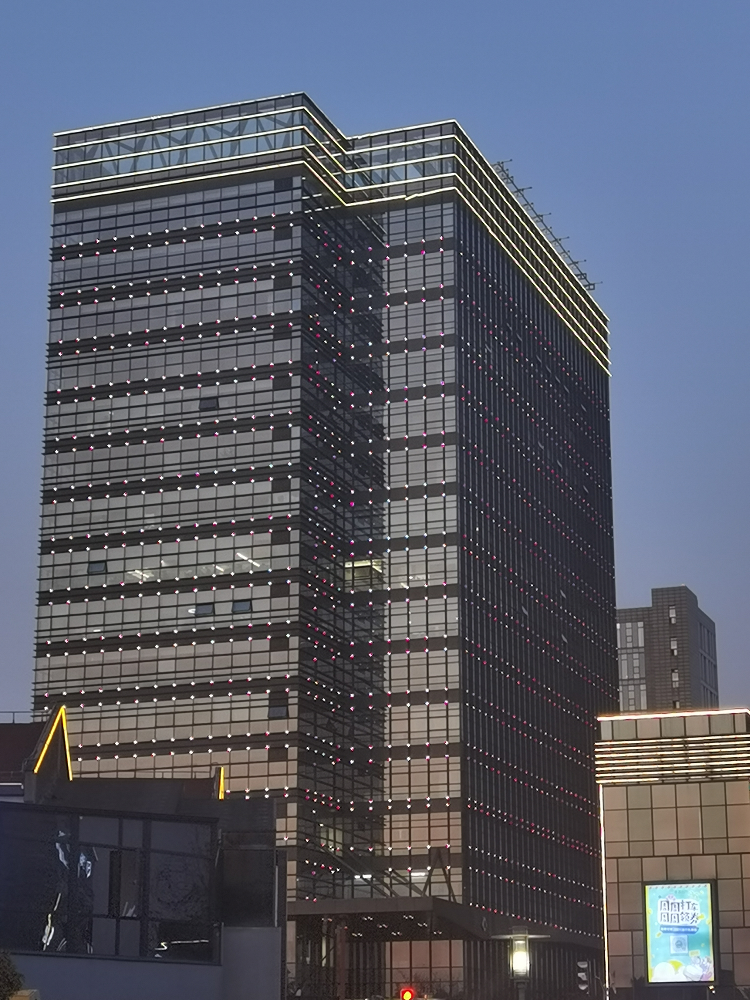

+++
author = "Electronic-Waste"
title = "四月，告别邦戴"
date = "2024-04-26"
description = "记录我的第一段实习"
categories = [
    "Conclusion"
]
tags = [
   
]
+++

## 前言

2024.4.24星期三，我结束了我的第一段量化实习，向曾经工作过三个月的地方投去了最后一瞥。

  

退掉了租的房子，在回学校的出租车上，npy问我会想念这段实习的时光吗。我沉思了一会儿，望着着窗外渐渐消失在视野里的小公寓，看着熟悉到不能再熟悉的每天上班下班打过照面的行道树，这三个月遇见的人遇见的事像老电影，在我脑海里一帧帧播放，像流淌的溪水，时而缓慢而无言，时而湍急而跳跃。片刻之后，我转过头回答道：

> 我想我会永远记得！

## 回顾

事情要从大三暑假开始说起，如我在[2023年终总结](https://blog.electronicwaste.cn/p/2023年度总结/)中所提到的，由于种种原因我最终选择了保研，在暑期进入了任老师的实验室做项目。在七月底的时候，我阶段性完成了项目，任老师让我去干些其他的事情换换脑子，于是我便开始了我跌跌撞撞的刷题找工之旅。

整个过程断断续续持续到今年一月份，中间穿插着保研、项目、毕设，也有未成行的实习offer。在完成毕设论文写作之后，机缘巧合之下我拿到了邦戴的实习offer。中间和高策学长聊过天，学长建议我如果想去量化的话一定要先去实习一次看看，这样才能知道量化适不适合自己。于是我便接了offer，以Infrastructure Intern的身份加入了邦戴，开始了我的实习之旅。

在公司我独立负责了一个基础架构演进的项目，原有的基于共享文件夹和csv文件的行情数据存储系统在数据分析业务中成为了性能瓶颈，我需要调研现有的时序数据库/关系型数据库/数据湖仓，与相关厂商接触，基于业务场景和使用者需求完成性能测试和兼容性测试，以选择最适合公司OLAP业务场景的数据库。随后，我需要从0到1设计和搭建一套新的企业级高可用、高性能、高可扩展的存储系统，以实现对公司数据分析业务一个数量级以上的性能提升。

虽然由于时间原因没来的及把一整套系统搭起来，但最后还是将整个系统的蓝图画好了，把我所有的工作交接给继任者了，也算是为自己第一段实习交了一份还算满意的答卷吧。

但实习之路并非一番风水，我像所有刚进入社会的毕业生一样，努力地调整自己的角色，适应着学生到职场人的身份转变，其中心酸只能自己体会，很难用寥寥几句描述，我也不想将那些脆弱时刻写出来放在博客里，就草草带过吧。不过经历过之后我才明白，能在学校读书其实是一件很幸福的事情，幻想中长大后经济独立、外表光鲜、工作体面的成年人生活在真正到来时，其实你也并不会感到很幸福，相反，你会更怀念曾经纯粹美好洋溢着青春气息的的学生时代。

## 总结

这一次实习有很多收获，相比于技术上的提升，我觉得我在人际沟通、项目管理以及调查研究方面的提升会更大一些。与此同时，我变得更加地了解了量化这个行业，也开始知道各个岗位在业务中所扮演的角色，不再只是通过网络上的信息和师长的口述了解这个行业，也算是不虚此行。

下面是我个人的一些收获，希望对看这篇博客的你有所启发：

1. 人际沟通：相比于学校课堂"push"类型的消息推送模式，在公司里获取信息的模式大不相同，需要不断去向各个消息源发起"pull"请求。有不懂的地方需要主动找到对应的人请教，业务需求方面需要主动地和相关方沟通协调，需要定时向上汇报讲清楚成果和遇到的问题，并且合适合时切中要害...

2. 项目管理：由于是一个0到1的项目，我同时承担了PM、Tech Lead还有牛马的角色，因此或主动或被迫学到了很多项目管理方面的知识，比如预期管理、迭代计划制定、进度控制、需求分析等等。我开始认识到沈阿姨上的《软件工程原理》其实就是项目管理的精髓，只是自己当时太年轻觉得技术为王，错把屠龙术当作切菜刀，没有足够的重视。

3. 调查研究：我对市面上二十几个时序数据库/关系型数据库/数据湖仓进行了调研，熟悉了各种类型的数据库，并对其中符合业务要求的进行了测试，最终找到了最适合公司业务需求的一个数据库。我认为这个过程对我的帮助很大，我开始清楚地认识到不管需要做什么事情，研究也好项目也罢，都需要对现有的解决方案（在学术研究中是论文，在工业界是开源项目/商业产品）进行细致的调研，了解他们具体解决的问题面向的场景，将各个解决方案拼成一整块地图，并从中找到自己的研究或者公司的业务在地图中的位置，这样才能游刃有余地选择合适的方式去解决问题。

## 展望

这段实习圆了我本科实习的心愿，让我对量化行业有了亲身体会，也让我学到了很多。在未来可预见的一年多时间里我应该是不会再实习了，但我会补齐自己在实习过程中发现的个人能力的短板，努力让自己能够成为多面手，能够胜任各种不同的岗位。此外我还会在实验室专注于探索云原生和网络领域，并试图去解决现有的一些问题，希望能有所收获有所成就吧。

同时我也强烈建议看到这篇博客的学弟学妹本科期间一定要出去实习一次看看，感受一下公司和学校的差异，学一些学校不会交给你的东西，这样才能在读研/出国/工作的人生重大选项关头对各种选择有更多更切身的体会，不随波逐流，做最适合自己的选择。

说点无关内容😎，这段实习极大充实了我的小金库(doge)，让我多少能有些零花钱更新换代手头的电子产品，也让我更加憧憬毕业后的旅行：

> “欲买桂花同载酒，终不似，少年游”
> 
> 对于目前的我来说，钱是攒不了一点的。因为我想趁着青春年少还有时间出去走走的时候多去看看祖国的大好河山，去通过旅行开阔自己的眼界、提升自己的阅历。
> 成为社畜之后请个假都要思索再三，要想想leader和老板会不会对自己有意见，再也不会有这样大把大把惬意而纯粹的时光了，也不太可能有说走就走的旅行了。
> 
> 因此我选择珍惜当下的青春年华，注重当下的生命体验。
