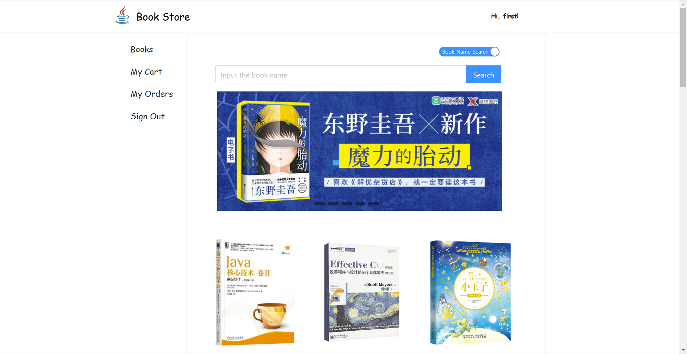
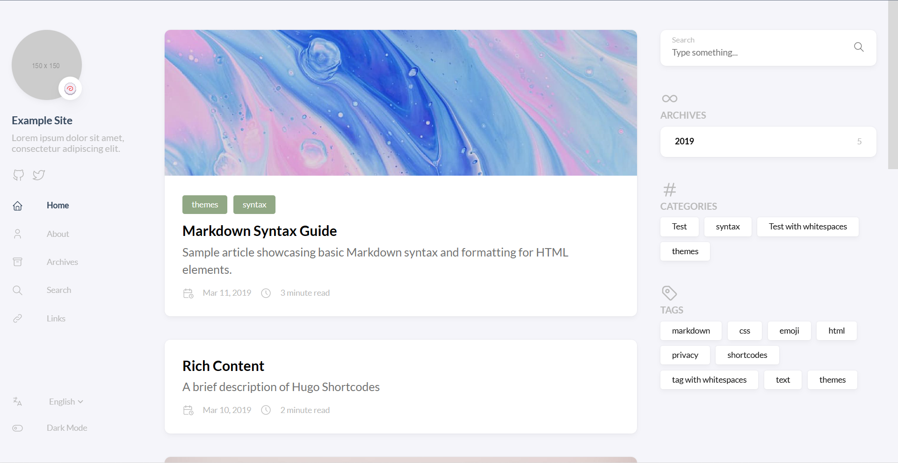
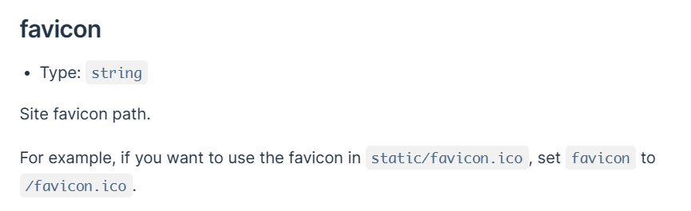
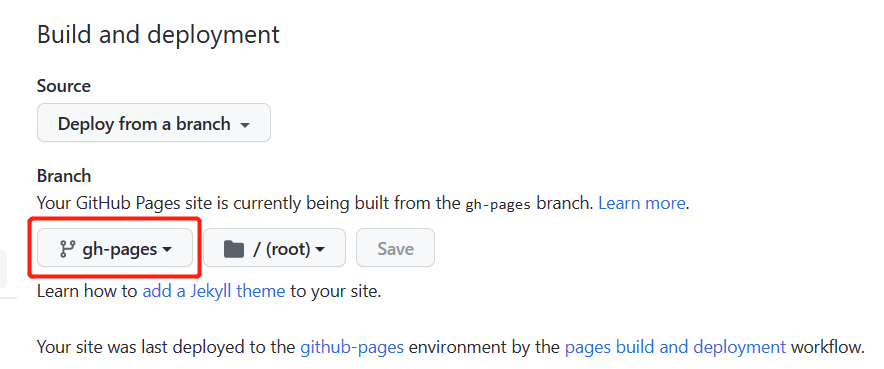
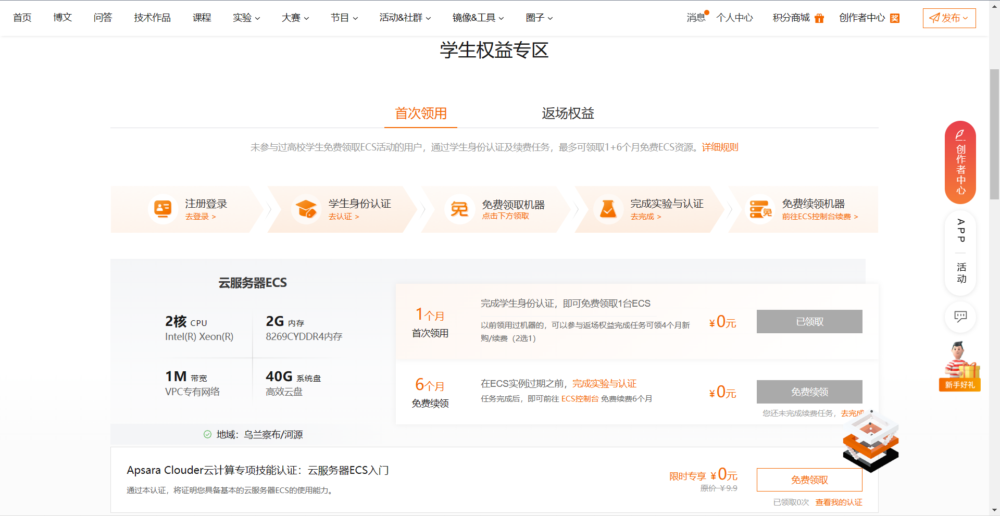
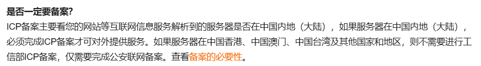
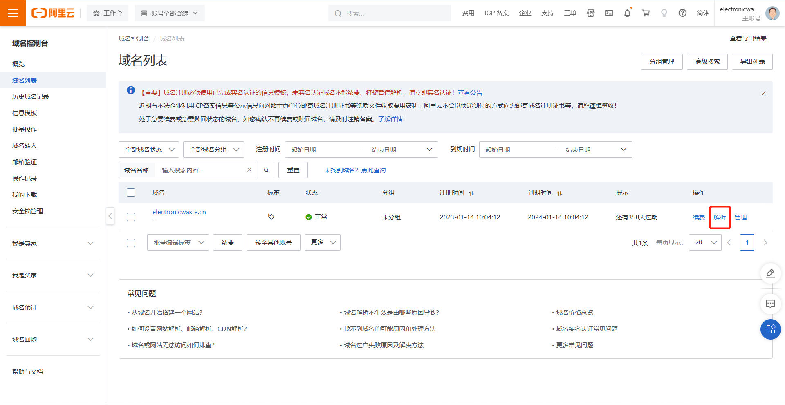
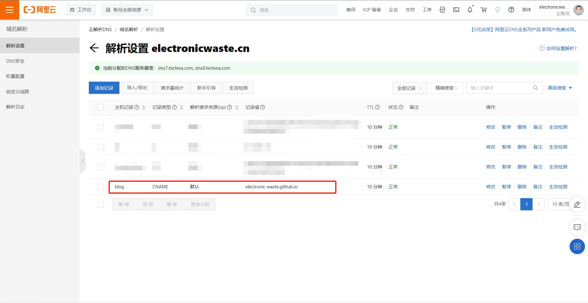

+++
author = "Electronic-Waste"
title = "利用Hugo+GithubPage+阿里云搭建博客网站（保姆级教程）"
date = "2023-01-20"
description = "手把手教你搭建一个属于自己的博客"
categories = [
    "Guide"
]
tags = [
   
]
+++

## 前言
这个博客使用Hugo+GithubPage+阿里云服务搭建完成。

虽然我们专业在大二下开始就安排了互联网开发课程，涉及前端、后端、数据库以及服务器运维和项目管理，但是可能是由于从小缺乏美术细胞，我设计出来的UI界面巨丑无比😭，给大家直观感受一下：



于是秉持着"用自己写的代码恶心自己可以，但不能恶心别人"的基本道德观念，我发扬了"造不如买，买不如租"的精神🐶，投入到了开源项目的怀抱。不得不说，大佬们设计的UI是真的好看。在千挑万选之下，我选择了[hugo-theme-stack](https://github.com/CaiJimmy/hugo-theme-stack)作为网站的主题，并采用Hugo作为build页面的工具。这样一来，搭建网站所耗费的时间精力就大大减小了，这拯救了我本来就不多的头发😭。



与此同时，Github也提供了[GithubPage](https://pages.github.com/)服务，能在远端自动构建网页（这不就是一个免费的服务器嘛！不用白不用！）。操作也较为简单，只需要`git push`再简单配置一下就可以直接使用。于是又懒又穷的我就选用了GithubPage哈哈哈！

此外，由于众所周知的原因，Github在国内的连接是不稳定的，可能会出现无法访问的情况。因此，我为GithubPage添加了阿里云提供的域名解析服务，这样能大大加快国内用户访问我的博客的速度，也能提高访问的稳定性。

下面开始我们的教程部分：
## Hugo安装与配置
安装部分较为简单，直接去[Hugo Release](https://github.com/gohugoio/hugo/releases)下载与电脑环境相同的最新版本压缩包即可。由于我的电脑是Windows系统的，因此我下载的是与Windows系统适配的版本，而且之后所有配置本地环境的步骤均是在**Windows环境下**进行的。

> 此外，我们需要注意各个theme对hugo版本的要求，例如我所采用的hugo-theme-stack的[官方文档](https://stack.jimmycai.com/guide/getting-started)要求安装extented版本的hugo。具体的情况视所采用的主题不同而不同。

安装完成后，我们需要在Windows的系统环境变量中添加`hugo.exe`所处目录的位置，以保证hugo能在Windows系统全局运行。

这之后，我们就可以在新建的本地目录（用于本地构建网站）使用hugo创建新的样例网站啦！

```shell
$ hugo new site .   # 在当前目录下创建
$ hugo server     # 在本地1313端口构建网站
```

然后打开`localhost:1313`就能看到丐版的网页了！

## Stack主题的安装与配置
>整理自[stack主题官方文档](https://stack.jimmycai.com/guide)以及相关的技术博客

丐版的网页显然不能直接用，因为实在是太粗糙了，甚至比不上我自己写的网页。

所以我们需要挑选一个合适的hugo主题——[hugo-theme-stack](https://github.com/CaiJimmy/hugo-theme-stack)出场（此处有bgm）！

这款主题可以说，既能简约，又能做得比较华丽，可DIY性可以说是比较强的了，~~配色还十分合我的胃口~~，那么就是它了！

### 安装Stack主题

我们从Github代码仓库把它拷过来，放入`/theme`目录下

```shell
$ git init
$ git submodule add https://github.com/CaiJimmy/hugo-theme-stack/ themes/hugo-theme-stack
```

>直接进行git clone的话之后在GithubPage配置的时候好像会出现问题，因此我推荐在这里使用`git submodule add`来代替`git cone`

然后把`theme/hugo-theme-stack/exampleSite`目录底下的所有文件复制到网站的根目录下。这里我们会发现根目录下有`config.toml`和`config.yaml`两个配置文件。在功能上，这两者没什么区别，都是用于配置的，只不过语法略有些差异。在这里，我们删除`config.toml`，留下`config.yaml`。

这个时候再在命令行中重新运行`$ hugo server`即可看到stack主题的网站啦！下面就是属于自己的DIY时间了！

### 配置stack主题

接下来的配置就是将自己个性化的东西放上去，比如网页的favicon，自己的头像和个性签名，以及menu bar的内容等等。此外，我删除了评论功能，因为感觉个人博客不太需要交互。

话不多说，直接上我的配置：
```yaml
baseurl: https://blog.electronicwaste.cn
languageCode: zh-cn
theme: hugo-theme-stack
paginate: 5
title: Electronic-Waste的博客

languages:
    zh-cn:
        languageName: 中文
        title: Electronic-Waste的博客
        description: 欢迎常来看看！！！
        weight: 1

    # en:
    #     languageName: English
    #     title: Electronic-Waste's Blog
    #     description: Welcome!!!
    #     weight: 2

# Change it to your Disqus shortname before using
disqusShortname: hugo-theme-stack

# GA Tracking ID
googleAnalytics:

# Theme i18n support
# Available values: ar, bn, ca, de, el, en, es, fr, hu, id, it, ja, ko, nl, pt-br, th, uk, zh-cn, zh-hk, zh-tw
DefaultContentLanguage: zh-cn

# Set hasCJKLanguage to true if DefaultContentLanguage is in [zh-cn ja ko]
# This will make .Summary and .WordCount behave correctly for CJK languages.
hasCJKLanguage: true

permalinks:
    post: /p/:slug/
    page: /:slug/

params:
    mainSections:
        - post
    featuredImageField: image
    rssFullContent: true
    favicon: /img/favicon.ico

    footer:
        since: 2022
        customText:

    dateFormat:
        published: Jan 02, 2006
        lastUpdated: Jan 02, 2006 15:04 MST

    sidebar:
        emoji: 🍥
        subtitle: 人生不得行胸臆，纵年百岁尤为夭
        avatar:
            enabled: true
            local: true
            src: img/avatar.jpg

    article:
        math: false
        toc: true
        readingTime: true
        license:
            enabled: true
            default: Licensed under CC BY-NC-SA 4.0

    widgets:
        homepage:
            - type: search
            - type: archives
              params:
                  limit: 5
            - type: categories
              params:
                  limit: 10
            - type: tag-cloud
              params:
                  limit: 10
        page:
            - type: toc

    # opengraph:
    #     twitter:
    #         # Your Twitter username
    #         site:

    #         # Available values: summary, summary_large_image
    #         card: summary_large_image

    defaultImage:
        opengraph:
            enabled: false
            local: false
            src:

    colorScheme:
        # Display toggle
        toggle: true

        # Available values: auto, light, dark
        default: auto

    imageProcessing:
        cover:
            enabled: true
        content:
            enabled: true

### Custom menu
### See https://docs.stack.jimmycai.com/configuration/custom-menu.html
### To remove about, archive and search page menu item, remove `menu` field from their FrontMatter
menu:
    main: []

    social:
        - identifier: github
          name: GitHub
          url: https://github.com/Electronic-Waste
          params:
              icon: brand-github
        - identifier: zhihu
          name: Zhihu
          url: https://www.zhihu.com/people/zhong-hua-yi-diao-si
          params:
              icon: zhihu
        - identifier: mail
          name: Gmail
          url: mailto:shaowang2002@gmail.com
          params:
              icon: mail

related:
    includeNewer: true
    threshold: 60
    toLower: false
    indices:
        - name: tags
          weight: 100

        - name: categories
          weight: 200

markup:
    goldmark:
        renderer:
            ## Set to true if you have HTML content inside Markdown
            unsafe: false
    tableOfContents:
        endLevel: 4
        ordered: true
        startLevel: 2
    highlight:
        noClasses: false
        codeFences: true
        guessSyntax: true
        lineNoStart: 1
        lineNos: true
        lineNumbersInTable: true
        tabWidth: 4
```
具体各个参数的含义参见[官方文档](https://stack.jimmycai.com/guide)

非常坑爹的一点发生在我设置favicon的时候，官方文档描述得实在是太简略了：



当我照着上面的做，把`favicon.ico`直接放在了static目录下是，我却发现不管我再怎么刷新网页，再怎么重启hugo service，都没有办法生成网页图标（当时的内心是崩溃的）。在翻了无数资料之后，我才在[Github Issue](https://github.com/CaiJimmy/hugo-theme-stack/issues/597)中的一个小角落发现了这个问题的解决方案——在`/static`文件夹中新建一级目录，将与`favicon.ico`有关的所有文件全部放入这个目录，并且更改`config.yaml`中的`params.favicon`项。到此才算完成了网页样式的个性化定制，cheers!

另外，推荐一个生成favicon的网站——[realfavicongenerator](https://realfavicongenerator.net/)。使用体验极佳，而且全免费。

## GithubPage
GithubPage的配置十分简单：
1. 在Github新建一个以`<YOUR_GITHUB_USERNAME>.github.io`命名的仓库
2. 在本地网页根目录下新建`.github/workflows/gh-pages.yml`文件，文件具体内容如下
```yaml
name: github pages

on:
  push:
    branches:
      - main  # Set a branch that will trigger a deployment
  pull_request:

jobs:
  deploy:
    runs-on: ubuntu-22.04
    steps:
      - uses: actions/checkout@v3
        with:
          submodules: true  # Fetch Hugo themes (true OR recursive)
          fetch-depth: 0    # Fetch all history for .GitInfo and .Lastmod

      - name: Setup Hugo
        uses: peaceiris/actions-hugo@v2
        with:
          hugo-version: 'latest'
          extended: true    # Attention: this is set when the extented version of hugo is needed 

      - name: Build
        run: hugo --minify

      - name: Deploy
        uses: peaceiris/actions-gh-pages@v3
        if: github.ref == 'refs/heads/main'
        with:
          github_token: ${{ secrets.GITHUB_TOKEN }}
          publish_dir: ./public
```
3. 将本地文件`config.yaml`中的`baseurl`设置成`<YOUR_GITHUB_USERNAME>.github.io`
4. 将本地仓库`git push`到远端main的分支，让Github Action来构建网页
5. 在仓库中的"Settings"->"Code and automation"->"Pages"页中将"Branch"改成"gh-pages"


## 阿里云
起初我以为搭建网站需要一台云服务器，于是和阿里云斗智斗勇，做了几个任务，白嫖了7个月的学生机——2核2GB内存的ECS，远在华北的乌兰察布。



但是后来直到我配置完成才发现貌似根本不需要云服务器，这下小丑竟是我自己了🤡

不过反正是免费的，无所谓了哈哈哈，下次换腾讯云/华为云/AWS白嫖。

### 购买域名
在工作台中进入“域名”选项，选择“注册域名”，然后根据提示选择自己喜欢的域名即可

我选的是`electronicwaste.cn`，花了我29块大洋，有点小贵😭，够我在玉兰苑大吃一顿麻辣烫了

之后可能要对域名进行实名认证（这个不是备案），然后激活这个域名，整个过程不超过10min，阿里云在这点上还是非常给力的😋

### 域名解析
看到网上有很多教程说要去工信部ICP备案，但我发现好像不用？



Github的服务器在国外，因此为GithubPage添加域名解析时不用进行备案。只要我不被当成“境外势力”“50W”打掉就行了🐶，在实操过程中这种个人博客“相关部门”一般不会管，因此简单配置一下域名解析就好了：





这样我们马上就可以使用`blog.electronicwaste.cn`访问我的博客啦！

### GithubPage以及相关配置更新
1. 更改`config.yaml`中的`baseurl`为`blog.electronicwaste.cn`（请把这个域名改成你自己配置的那一个，下面步骤中不再复述）
2. 在`/static`目录下增加一个`CNAME`文件，将`blog.electronicwaste.cn`写入即可
3. 将本地代码仓库的代码`git push`到Github中
4. 在Github的仓库中"Settings"->"Code and automation"->"Pages"页中将'Enforce HTTPS"选中
5. 大功告成！你现在可以用`blog.electronicwaste.cn`来访问博客了！🍻

## 文章内容的撰写
详情见[Stack主题官方文档](https://stack.jimmycai.com/guide)以及[Hugo官方文档](https://www.gohugo.org/doc/overview/quickstart/)。

建议在完全了解Hugo Site文件架构以及页面显示的关系之后再开始修改目录和文章。因为这篇博客的主要内容是讲如何配置搭建博客的，所以如何去撰写自己的博客文章就要大家自己去摸索了。

此外，要重视官方文档。官方文档虽然有些地方写得很简略而且会有bug，但是无论在内容的丰富程度上还是准确程度上，都是吊打CSDN的一些技术博客的（当然也包括我的博客）。

也可以将官方的示例代码和Demo拿来看，这样子上手会快很多。

好好摸索吧！骚年！

## 一些感想&吐槽
搭建博客的过程并不是一帆风顺的，我前前后后大概花了三四天的时间，中间踩了很多的坑。

最崩溃的时候莫过于遇上favicon那个奇奇怪怪的Bug的时候。官方文档里面的内容少之又少，给的配置还是错的，我当时完全不知道该怎么办了。虽说stack这个theme比较火，但是网上的参考资料还是少之又少，根本无从下手解决。而且本人有强迫症🤡，虽然没有这个图标网页照样能跑，但是丑陋的默认图标让我异常难受。我的强迫症不容许它的存在！

在经历了一下午的痛苦与折磨之后，我终于在某个犄角旮旯里找到了这个问题的解决方法，也就是前文中提到的[Github Issue](https://github.com/CaiJimmy/hugo-theme-stack/issues/597)，真的有一种“柳暗花明又一村”的感觉。

不过，看到自己的博客网站在自己一点一点的努力中逐渐搭建成型，我还是非常开心非常有成就感的！而且这个过程也十分有意义，因为在此之前我一有什么问题就直接Bing找各种博客看，如果找不到就直接摆烂🤡。但是这一次，我会静下心来去研究官方文档，跑官方给的例子，去官方的Github仓库里去看代码和别人提的issues了。怎么说，感觉自己还是有很大进步的！

最后，这个网站终于能完整而优雅地跑起来了。欢迎大家常来看看，也欢迎大家多提提建议呀！