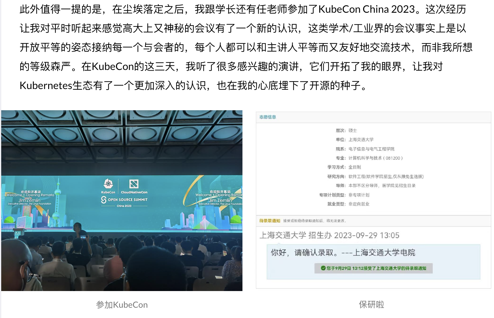

+++
author = "Electronic-Waste"
title = "开源与我：在一周年之际"
date = "2025-03-26"
description = "我很幸运，找到了自己喜欢做的事情"
categories = [
    "oss",
    "conclusion"
]
tags = [
   
]
+++

## 前言

> 回望来时的路，实在思绪万千...

我是一个非常喜欢总结的人，擅长用不那么细腻的笔触记录自己的想法。但由于平时忙于各类coding活动，我已渐渐变得麻木，鲜有停下来思考的念头，只是一直move on，告诉自己向前看。可能是一段感情破碎的缘故。在巨大的痛苦之中，我不再能忽视自己的感受一直往前走，而需要停下来思考、舔舐伤口。因此，由于无法回避的痛苦，我有了很多时间去思考。

在闲时偶然翻看日历，我在猛然间想起自己下定决心加入开源社区刚好到了一年。往日的点点滴滴像电影，一幕幕浮现在心头，有些感动，想落泪。原来我已经走过了一段很长很长的路，离开了软院大二大三高压课程的阴霾，把曾经那个无助悲观自信心崩塌的自己又好好养了一遍；原来我不是那么不堪，可以给社区乃至世界带来一些变化，我的付出是有价值的，是可以得到认可的。

实在是思绪万千。

## KubeCon China 2023

故事的开始要从KubeCon China 2023开始讲起。彼时的我刚保完研，对Kubernetes以及整个云原生领域懵懵懂懂，按照任老师的话说，就是“无论让他干什么都行，没有自己的想法”的本科生（笑）。幸运的是我赶上了最后一届在上海开的KubeCon，跟着任老师还有学长们一起去听了三天。虽然几乎什么都听不懂，但是会场的氛围深深地感染了我，我觉得站在台上做演讲的开发者们眼里都带着光，闪烁着对开源社区的热忱，他们也实打实地践行着开源社区“平等、开放、包容”的精神，对我提的一些在现在看来比较“愚蠢”的问题也会耐心解答。除了会场的午饭晚饭比交大食堂还难吃之外，真的找不到KubeCon什么缺点了。

于是，我也开始想成为像他们那样的人。**在商业利益之外，出于最朴实的热爱，无私地为这个世界做出一些自己的贡献；帮助后来者加入开源的队伍，让开源的价值观越来越有影响力；包容文化、地域、肤色、种族等带来的差异，一起为同一个目标努力**。这种帮助、奉献、受到认可所带来的纯粹的快乐，我认为是很难通过金钱达到的。而且人生在世，如果一直追逐金钱，也未免太过无趣，总是要做一些更有意义的事情才好。

下面是我23年写的一些文字：

后来在交流中发现，我的文字对一些学弟学妹选择实验室的决策带来了一定的影响，让我有些许愧疚。可能开源也是一把双刃剑吧，希望他们以后不要怪我（笑）。

