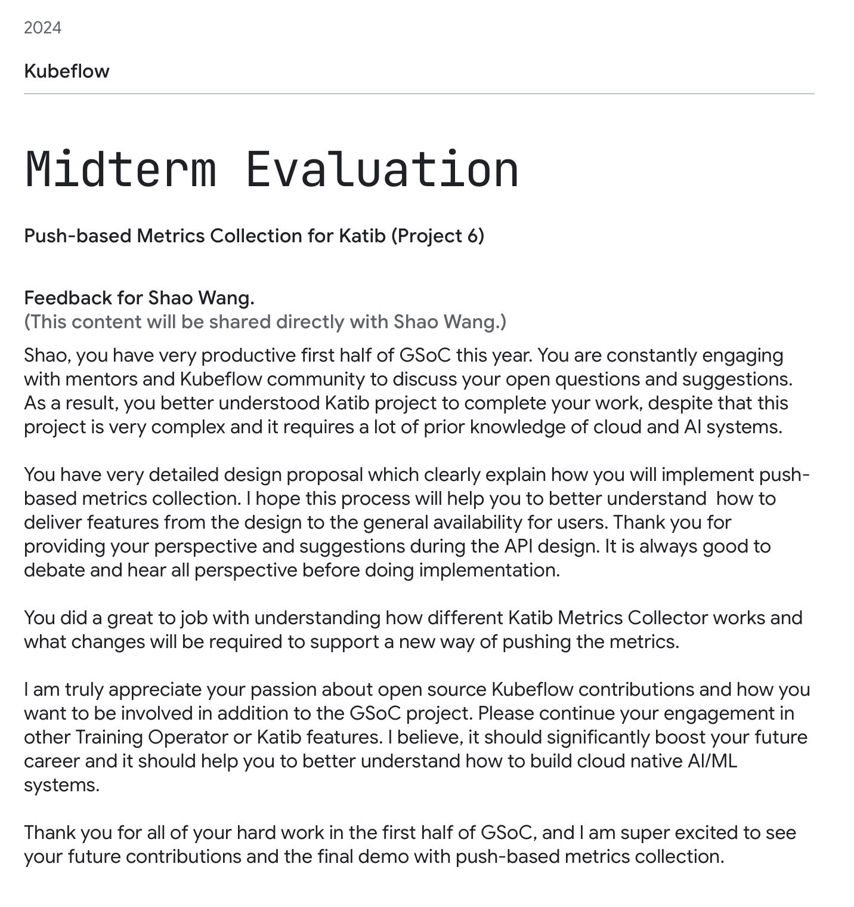
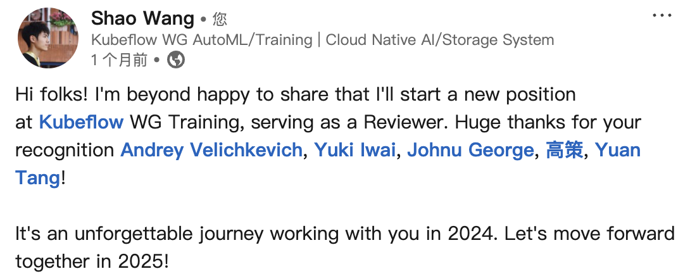

+++
author = "Electronic-Waste"
title = "开源与我：在一周年之际"
date = "2025-03-26"
description = "我很幸运，找到了自己喜欢做的事情"
categories = [
    "oss",
    "conclusion"
]
tags = [
   
]
+++

## 前言

> 回望来时的路，实在思绪万千...

我是一个非常喜欢总结的人，擅长用不那么细腻的笔触记录自己的想法。但由于平时忙于各类coding活动，我已渐渐变得麻木，鲜有停下来思考的念头，只是一直move on，告诉自己向前看。可能是一段感情破碎的缘故。在巨大的痛苦之中，我不再能忽视自己的感受一直往前走，而需要停下来思考、舔舐伤口。因此，我有了很多时间去思考。

在闲时偶然翻看日历，我在猛然间想起自己下定决心加入开源社区刚好到了一年。往日的点点滴滴像电影，一幕幕浮现在心头，有些感动，想落泪。原来我已经走过了一段很长很长的路，离开了软院大二大三高压课程的阴霾，把曾经那个无助悲观自信心崩塌的自己又好好养了一遍；原来我不是那么不堪，可以给社区乃至世界带来一些变化，我的付出是有价值的，是可以得到认可的。

实在是思绪万千。

## KubeCon'23 China

故事的开始要从KubeCon China 2023开始讲起。彼时的我刚保完研，对Kubernetes以及整个云原生领域懵懵懂懂，按照任老师的话说，就是“无论让他干什么都行，没有自己的想法”的本科生（笑）。幸运的是我赶上了最后一届在上海开的KubeCon，跟着任老师还有学长们一起去听了三天。虽然几乎什么都听不懂，但是会场的氛围深深地感染了我，我觉得站在台上做演讲的开发者们眼里都带着光，闪烁着对开源社区的热忱，他们也实打实地践行着开源社区“平等、开放、包容”的精神，对我提的一些在现在看来比较“愚蠢”的问题也会耐心解答。除了会场的午饭晚饭比交大食堂还难吃之外，真的找不到KubeCon什么缺点了。

于是，我也开始想成为像他们那样的人。**在商业利益之外，出于最朴实的热爱，无私地为这个世界做出一些自己的贡献；帮助后来者加入开源的队伍，让开源的价值观越来越有影响力；包容文化、地域、肤色、种族等带来的差异，一起为同一个目标努力**。这种帮助、奉献、受到认可所带来的纯粹的快乐，我认为是很难通过金钱达到的。而且我觉得人生在世，如果一直追逐金钱，也未免太过无趣，总是要做一些更有意义的事情才好。

下面是我23年写的一些文字：

后来在交流中发现，我的文字对一些学弟学妹选择实验室的决策带来了一定的影响，让我有些许愧疚。可能开源也是一把双刃剑吧，希望他们以后不要怪我（笑）。

## 一些出乎意料的正反馈

大四下学期，我开始在一家量化公司实习。或许是第一次体验到上班的感觉，或许是干一行恨一行，我觉得每日的生活都非常的枯燥，公司跟公寓两点一线，早上起来就去公司，上完班就回家躺在床上玩手机。而且由于第一次长时间离开闵行去上海接触社会（闵行不是上海），没有了学校里的活人气息，我时常感到冰冷和孤独，想到这样的生活自己以后还要过40年就有点绝望——这甚至不像软院的Lab好歹有个尽头。

于是我想给自己找些事情做，好歹洗洗自己身上的班味。想起自己上个学期参加过的KubeCon，我把目光放在了开源社区，和它对应的开源实习[Google Summer of Code(GSoC)](https://summerofcode.withgoogle.com/)上。我希望能够找到自己热爱的事情，让我在将来长达40年的牛马生涯里不被工作填满——**至少有些期待和热情，能让我觉得今天和昨天不一样**。于是我在我比较感兴趣的Cloud Native AI System领域中，瞄准了[Kubeflow](https://github.com/kubeflow)，开始做一些微不足道的贡献：）

让人惊喜的是，接下来发生的事情，让我觉得我的小小贡献也是被人重视被人认可的，这让我有了最初的正反馈。现在想来，可能正是有了这样的一群人的鼓励和帮助，我才能这条路上坚持下来。

 

可能是运气好，可能是碰上了一个很好很懂得鼓励人的组织，我心里的那一颗小火苗被他们好好地呵护着，没有被一开始的不适应浇灭，也没有因为还是新手所以得不到平等对待。**不得不承认，最初的正反馈是一件非常重要的事情，如果能让刚加入组织的人能感受到尊重、感受到认可，那么这个组织的方方面面一定都非常棒，也注定会发展壮大**！因此，我十分感谢他们，感谢他们用一点又一点的正向反馈点燃了我的热情和期待，让我下定决心今后要一直坚持为Kubeflow做贡献，并把这一份感动和期待，分享给更多还在迷茫中的同学们。

## GSoC'24

我一直觉得，我能申请的上Kubeflow的GSoC项目纯粹是因为运气好。有Kubeflow时隔4年入选GSoC打了所有申请者一个措手不及的缘故，有Kubeflow成为了Google亲儿子CNCF的孵化项目的缘故，也有最重要的实验室老学长[gaocegege](https://github.com/gaocegege)的帮助的缘故。就像一位长者说的，“一个人的命运，不仅要靠个人的奋斗，更要看历史的进程”（笑）。**而准确地识别并抓住这种机会，我想，则是每个人人生的必修课了**。

对于我申请的项目来说，它不是很难，我几乎很快就做完了，大部分的时间都在等Code Review。于是，我有了更多的时间去和Mentor们了解行业的动态、去参与社区的事务、做一些“不属于自己”的工作。因此，我也收获了一些振奋人心的反馈。

 

现在想来，我之所以会在GSoC项目之外做一些额外的贡献，可能是因为真的挺喜欢这个项目，以及我的Mentor [Andrey](https://github.com/andreyvelich)。我觉得做Cloud Native AI System是一件很酷的事情：Cloud Native意味着Scalability和Robustness，会有成千上万的应用运行在你写的系统上，由你负责解决可扩展和鲁棒性的问题（当然同时要高性能），非常有挑战性；AI，尤其是LLM，在我看来，意味着未来。而且我也很幸运，遇上了一位水平极高且极度负责的Mentor。他对我有求必应，经常指导我鼓励我，给我分享行业动态，同时熬最深的夜，把黑眼圈（🐼）留给自己，把及时高效的反馈留给我。

我真的很幸运，能让我坚持到现在还待在Kubeflow社区，喜欢项目和喜欢Mentor，二者缺一不可。依稀记得当时项目答辩结束时，我内心的心潮澎湃，那是一种感激与骄傲混杂的复杂心情。我感觉有一股热血涌上心头，和在场的所有社区成员表示：“我会一直留在Kubeflow社区，一直为社区做贡献的！”

## GSoC'24之后的迷茫

在GSoC'24结束不久，我顺利地晋升为Kubeflow子项目[Katib](https://github.com/kubeflow/katib)的Maintainer。

按照所有故事写的那样，当主角开心甚至有点膨胀的时候，反派就会出来爆锤主角一顿，让他认清现实。在这个时候，我觉得自己特别行，自信心爆棚，于是又去报名了其它的开源实习，想再复制一段“成功经历”。然而却遇到了很多的问题：

1. Idea是拍脑袋想的，根本不work
2. 更新过后的方案需要依赖其它的开源项目，工作量巨大，相当于要把项目重写一遍
3. 依赖的开源项目关停了老版本的支持，需要等待稳定新版本发布
4. 管理上的混乱...

直到过年前这件事都一直萦绕在我的心头，让我无比烦躁，我在备忘录里写下：

> 最近因为XXX项目死灰复燃而无比烦躁。这个项目对我来说无足轻重，我不想也不能再在这个项目上面花费更多的精力，因为有更多更重要的事情，像Kubeflow、实习、论文，在等着我去做。但是，我又由于各种各样的人和事没法立刻脱身，这让我十分十分十分的苦恼。有点像我本科时那失败的XXX ... 人需要学会去拒绝那些让自己内耗的人和事，这一次，我不会再让悲剧重演。

不过好在最后我还是脱身了，不用再内耗了。这也让我认识到，**选择是一件很重要的事情，成功是一件非常偶然的事情，成功需要好的选择，但有了好的选择不一定会成功**。盲目的选择大概率会带来不合适和痛苦，不论是开源社区、实习、工作，还是择友、感情。

## 折戟KubeCon'25 China

然而，这个事实上可能并不存在的反派，并不打算在阳春三月石楠花开的季节里，就那么放过我。我满怀信心地投了两篇KubeCon'25 China的Proposal，结果全给拒了🤡

那一夜我失眠了，在宿舍的小床上辗转反侧，那一个"Regretfully"是多么的刺眼，意味着几个月的心血付诸东流。我又一次在备忘录里写道：

> 今天凌晨睡不着，一次一次迷迷糊糊地打开手机查看邮件，在三点的时候，终于收到了KubeCon的投稿反馈——两篇都给拒了。一时间有点难以相信，又睁大眼睛重新检查了一下，结果还是一样，Regretfully不会变成Congratulations。虽然我期待了很久，但是等到结果之后，也并没有想象中那样，失望透顶。一阵恍惚，在手机屏幕刺眼的亮光和袭来的困意当中，我迷迷糊糊地看到了一条路，一条很长很长的路，没有尽头...

开源是一条很长很长的路，一蹴不能就。让我受到安慰的是，Andrey跟我说，他也等了四年：

> Hey, sorry to hear that, Shao, but the acceptance rate is super low right now (6-8%). FYI, I waited 4 years until my first talk got accepted at the main KubeCon + CloudNativeCon conference. You should continue to submit your talk to the next conferences, and also co-located events.

但我不会放弃，这不是我的风格，我会收拾好心情，然后重新出发。

## More Duty

在经历了一连串的打击之后，除了偶尔的怀疑人生之外，我依然在为Kubeflow社区稳定地贡献代码/审核PR，也因此平稳地混成了Kubeflow子项目[Trainer](https://github.com/kubeflow/trainer)的Maintainer。但众所周知Shao Wang不是什么安于现状的人，我渴望改变，接受失败，相信长期的价值大于短期的舒适。因此，我打算承担更多的责任，让自己得到更多的锻炼。

我干的第一件事情，是全盘接手Trainer的LLM Fine-tuning模块的设计实现工作。我花了三个月的时间打磨出[*Kubeflow LLM Trainer V2*](https://github.com/kubeflow/trainer/blob/master/docs/proposals/2401-llm-trainer-v2/README.md) 的设计实现文档，并获得社区讨论通过合入主分支，为LLM Fine-tuning on Kubernetes提出了属于Kubeflow的方案。我会在下一篇博客里详细介绍它，这里就不作赘述了。

我干的第二件事，也是我最自豪的事情，是成为了Kubeflow GSoC'25的Mentor。我无法忘记看到自己出现在KubeCon EU致谢名单里的那份感动，也无法忘记在GSoC'24中Kubeflow给我带来的强烈正反馈，更无法忘记Andrey对我的谆谆教诲与认可鼓励带给我的巨大影响。我想将他们带给我的感动和热情，通过我传递给更多的人们。这不仅是为了繁荣Kubeflow社区，更是为了吸引越来越多具有开源精神的人们加入开源社区，一起为开源事业做贡献。

第三件事情，是在交大校园里宣传开源和GSoC。通过水源和SJTUG校内群等各种媒介，我在线上线下开办了两场讲座，向对开源具有一定兴趣的同学们科普了什么是GSoC，并分享了GSoC申请经验。这绝对是我今年最难忘的事情，我觉得在这件事情上，我真正地践行了“平等、开放、包容”的开源精神，让GSoC和开源触达了更多的同学们。**倘若这对他们有一丝一毫的影响，那便是我最大的荣幸**。

此外，今年我尝试带着周围的一些同学申请GSoC，但可能是个人规划和学习工作压力等方面的原因，能坚持下来的寥寥无几。不过，能走出舒适圈本身就是一种很勇敢的行为，只是机缘不太巧合，我觉得一次就成功毕竟是少数，要允许自己反复。

值得一提的是，这也是我第一次担任类似于Mentor的角色，面对我带着一起申请的同学，我还是有些紧张、有些手足无措（笑）。就像是有一块巧克力，揣兜里怕化了，拿手上怕碎了，放那不管怕被偷走了。询问进度前经常会想是否会带来压力，遂经常默默删除聊天框里编辑的文字保持沉默，或者换一个话题切入；帮忙看PR时看急眼了，甚至有点想直接自己上手，不过好歹还是忍住了这种强烈的冲动；几天没贡献没提交，看到Org里面其他人PR提的飞起，心里那叫一个皇帝不急太监急。可能还是太年轻不够稳重，或者是不懂得尊重他人命运（叹气）。

## 尾声
